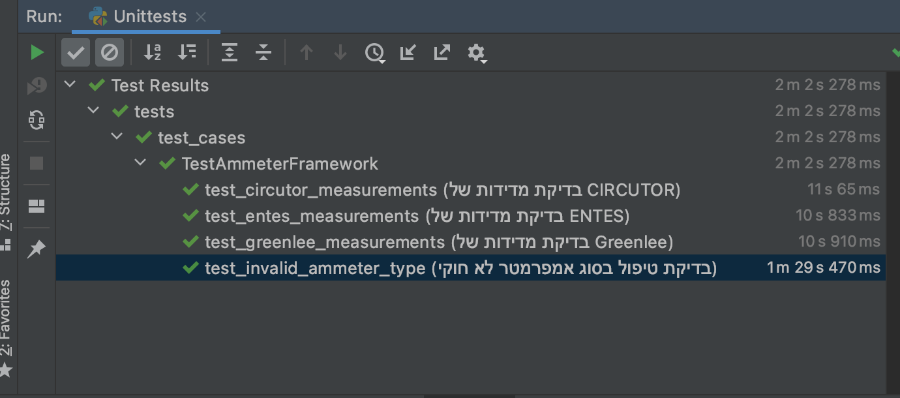

# Ammeter Emulators

This project provides emulators for different types of ammeters: Greenlee, ENTES, and CIRCUTOR. Each ammeter emulator runs on a separate thread and can respond to current measurement requests.

## Project Structure

- `Ammeters/`
  - `main.py`: Main script to start the ammeter emulators and request current measurements.
  - `Circutor_Ammeter.py`: Emulator for the CIRCUTOR ammeter.
  - `Entes_Ammeter.py`: Emulator for the ENTES ammeter.
  - `Greenlee_Ammeter.py`: Emulator for the Greenlee ammeter.
  - `base_ammeter.py`: Base class for all ammeter emulators.
  - `client.py`: Client to request current measurements from the ammeter emulators.
- `Utiles/`
  - `Utils.py`: Utility functions, including `generate_random_float`.

## Usage

# Ammeter Emulators

## Greenlee Ammeter

- **Port**: 5000
- **Command**: `MEASURE_GREENLEE -get_measurement`
- **Measurement Logic**: Calculates current using voltage (1V - 10V) and (0.1Ω - 100Ω).
- **Measurement method** : Ohm's Law: I = V / R

## ENTES Ammeter

- **Port**: 5001
- **Command**: `MEASURE_ENTES -get_data`
- **Measurement Logic**: Calculates current using magnetic field strength (0.01T - 0.1T) and calibration factor (500 - 2000).
- **Measurement method** : Hall Effect: I = B * K

## CIRCUTOR Ammeter

- **Port**: 5002
- **Command**: `MEASURE_CIRCUTOR -get_measurement`
- **Measurement Logic**: Calculates current using voltage values (0.1V - 1.0V) over a number of samples and a random time step (0.001s - 0.01s).
- **Measurement method** : Rogowski Coil Integration: I = ∫V dt

To start the ammeter emulators and request current measurements, run the `main.py` script:
```sh
python main.py
```

# Sasson's comments

The project seems to be already designed and implemented, just with a lot of broken stuff.

Fixes:
1. Uncomment lines.
2. Fix inconsistent command used (circutor command was changed according to the documentation)
3. Implement empty unimplemented functions. 
4. Added _to_json_safe() method since the results could not be converted to json.
5. I had to add django-basic-stats dependency.
6. Fixed stats.t.interval according to AciPy version.
7. Main is running successfully.
8. test_cases are running successfully.
9. visualization is working (see the results/plots folder). 


How to run the test cases:
python -m unittest tests.test_cases -v


